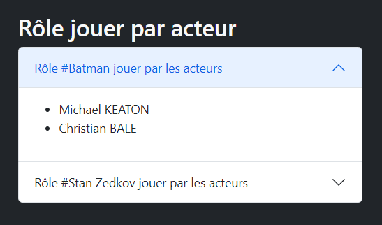
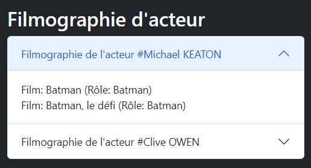
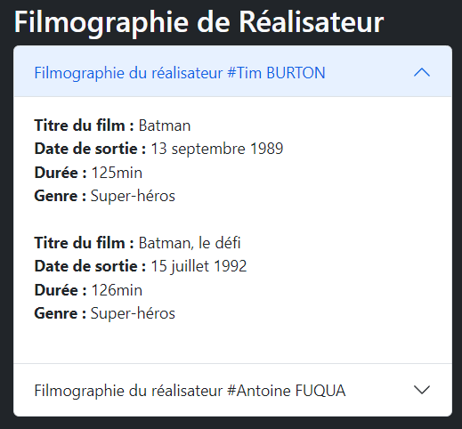

# POO_Cinema

PHP Orienté Object - Exercice Cinéma fait à Elan Formation

## Fonctionnalités

Pour cet exercice, il m'a été demander de faire plusieurs fonctions permettant d'afficher :

- La liste des acteurs ayant incarné un rôle précis
- Le casting d'un film (dans un film, le role a été jouer par...)
- La liste des films par genre
- La filmographie d'un acteur
- La filmographie d'un réalisateur

# Le rendu

## Liste des acteurs ayant incarné un rôle

## Le casting d'un film

## Liste des films par genre

## Filmographie d'un acteur

## Filmographie d'un réalisateur

